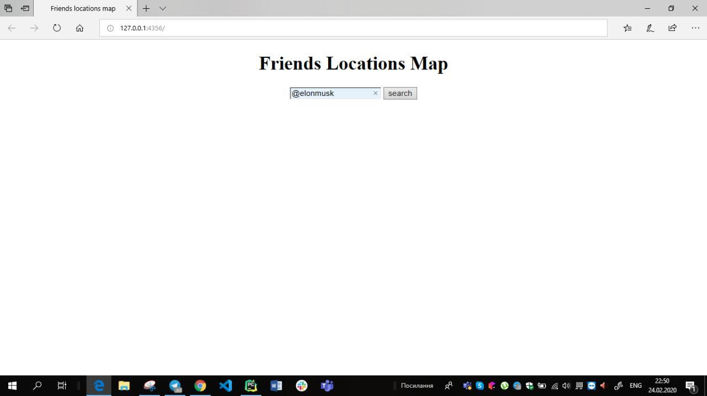
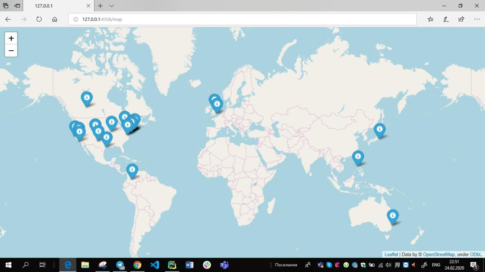

# Twitter-followers-locations-map

### Installation

Use the package manager [pip](https://pip.pypa.io/en/stable/) to install flask, geopy and folium.

```bash
pip install flask
pip install folium
pip install geopy
```
Also, you need to enter your personal keys for Twitter API in module "hidden.py"


### Description
This module creates a web-site where you can enter ane Twitter username and you'll see a map with markers of friends with their screen names.


### Example of module's work





## Author
Anna Pashuk
